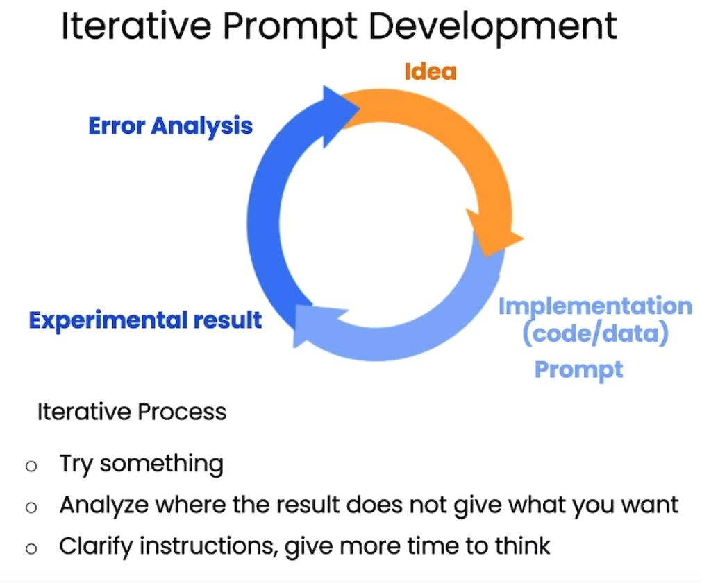

# Prompt Engineering for Devs
These are my notes from the "ChatGPT Prompt Engineering for Developers" course offered by OpenAI & DeepLearningAI

## Two types of Large Language Models (LLMs)
* __Base LLM__: 
Predict the next word based on text training data. 
* __Instruction Tuned LLM__: Tries to follow instructions. Fine-tune on instructions and good attempts at following them.

Models like ChatGPT start as a BaseLLM and then is further trained as an Instruction Tuned LLM, fine tuned with Reinforced Learning with Human Feedback(RLHF).

Treat those models as a very intelligent person, but not a mind reader. If the output is not what you wanted, then you need better instructions (usually). Be clear and specific.

## Guidelines
### Principles
1. Write clear and specific instructions.
    1. Use delimiters such as:
        * Triple quotes """
        * Triple backticks ```
        * Triple dashes ---
        * Angle brackets <>
        * XML tags \<tag>\</tag>
    2. Ask for structured output.
    3. Check whether conditions are satisfied.
    4. Few-shot prompting: give succesful examples of completing tasks, then asks the model to perform the task.
2. Give the model time to think.
    1. Specify the steps required to complete a task.
    2.  Instruct the model to work out its own solution before rushing to a conclusion

### Limitations
The model can "Hallucinate" when you give them a task that is plausible but is not actually "real". For example when you ask it to describe a fake product from real company.

## Iterative Process 
Generating a succesful prompt is an iterative process. 


## Use Examples
### Summarizing 
You can summarize text limiting the amount of words, sentences,etc by using a prompt such as:
```python
prompt = f"""
Your task is to generate a short summary of a product \
review from an ecommerce site. 

Summarize the review below, delimited by triple 
backticks, in at most 30 words. 

Review: ```{prod_review}```
"""
```

You also can skew the summary to relevant informantion by using a prompt such as:
```python
prompt = f"""
Your task is to generate a short summary of a product \
review from an ecommerce site to give feedback to the \
Shipping deparmtment. 

Summarize the review below, delimited by triple 
backticks, in at most 30 words, and focusing on any aspects \
that mention shipping and delivery of the product. 

Review: ```{prod_review}```
"""
```
Or only extract the relevant information from the text by using a prompt such as:
```python
prompt = f"""
Your task is to extract relevant information from \ 
a product review from an ecommerce site to give \
feedback to the Shipping department. 

From the review below, delimited by triple quotes \
extract the information relevant to shipping and \ 
delivery. Limit to 30 words. 

Review: ```{prod_review}```
"""
```
### Inferring
You can use prompts to get sentiment analysis, such as:
```python
prompt = f"""
What is the sentiment of the following product review, 
which is delimited with triple backticks?

Review text: '''{lamp_review}'''
"""
```

Or to identify emotions in the text, with prompts as:
```python
prompt = f"""
Identify a list of emotions that the writer of the \
following review is expressing. Include no more than \
five items in the list. Format your answer as a list of \
lower-case words separated by commas.

Review text: '''{lamp_review}'''
"""
```

To achieve the same results with supervised learning would take a lot of effort, yet this can be achieved easily using ChatGPT

You can also mix multiple tasks such as extracting the product's name and company's name, at the same time as getting sentiment analysis and costumer's emotions, with a prompt such as:
```python
prompt = f"""
Identify the following items from the review text: 
- Sentiment (positive or negative)
- Is the reviewer expressing anger? (true or false)
- Item purchased by reviewer
- Company that made the item

The review is delimited with triple backticks. \
Format your response as a JSON object with \
"Sentiment", "Anger", "Item" and "Brand" as the keys.
If the information isn't present, use "unknown" \
as the value.
Make your response as short as possible.
Format the Anger value as a boolean.

Review text: '''{lamp_review}'''
"""
```
You can get creative with those capabilites to create something such as news alert for certain topics, with a prompt as:
```python
prompt = f"""
Determine whether each item in the following list of \
topics is a topic in the text below, which
is delimited with triple backticks.

Give your answer as list with 0 or 1 for each topic.\

List of topics: {", ".join(topic_list)}

Text sample: '''{story}'''
"""
```

### Transforming
LLMs are very capable of performing text transformation tasks such as language translation, spelling and grammar checking, tone adjustment, and format conversion.

You can create an universal translator using the LLMs capabilities to detect text language and to translate, with a prompt such as:
for issue in user_messages:
```python
    prompt = f"Tell me what language this is: ```{issue}```"
    lang = get_completion(prompt)
    print(f"Original message ({lang}): {issue}")

    prompt = f"""
    Translate the following  text to English \
    and Korean: ```{issue}```
    """
    response = get_completion(prompt)
    print(response, "\n")
```

You can change the tone of your text, with prompts as:
```python
prompt = f"""
Translate the following from slang to a business letter: 
'Dude, This is Joe, check out this spec on this standing lamp.'
"""
```
Or grammar check and follow a style guide:
```python
prompt = f"""
proofread and correct this review. Make it more compelling. 
Ensure it follows APA style guide and targets an advanced reader. 
Output in markdown format.
Text: ```{text}```
"""
```
Transform between formats:
```python
data_json = { "resturant employees" :[ 
    {"name":"Shyam", "email":"shyamjaiswal@gmail.com"},
    {"name":"Bob", "email":"bob32@gmail.com"},
    {"name":"Jai", "email":"jai87@gmail.com"}
]}

prompt = f"""
Translate the following python dictionary from JSON to an HTML \
table with column headers and title: {data_json}
"""
```
### Expanding
You can create automated responses by expanding on previous information, such as the sentiment of a review, with the following prompt:
```python
prompt = f"""
You are a customer service AI assistant.
Your task is to send an email reply to a valued customer.
Given the customer email delimited by ```, \
Generate a reply to thank the customer for their review.
If the sentiment is positive or neutral, thank them for \
their review.
If the sentiment is negative, apologize and suggest that \
they can reach out to customer service. 
Make sure to use specific details from the review.
Write in a concise and professional tone.
Sign the email as `AI customer agent`.
Customer review: ```{review}```
Review sentiment: {sentiment}
"""
```
### Chatbot